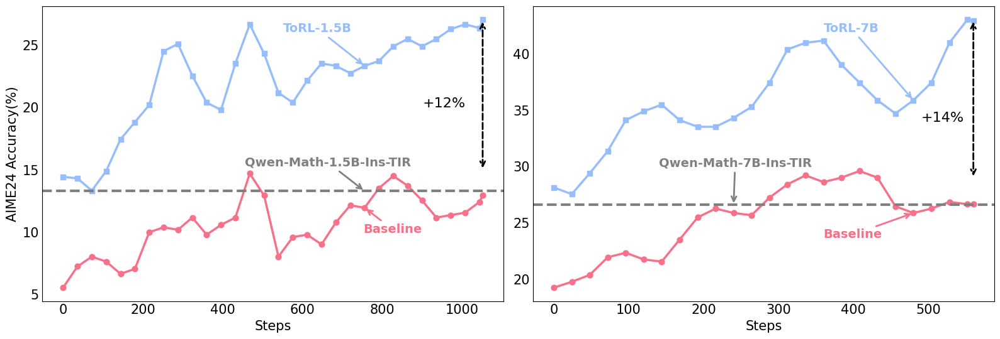
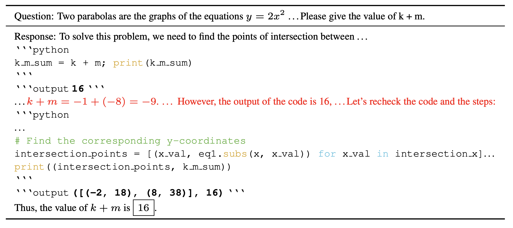
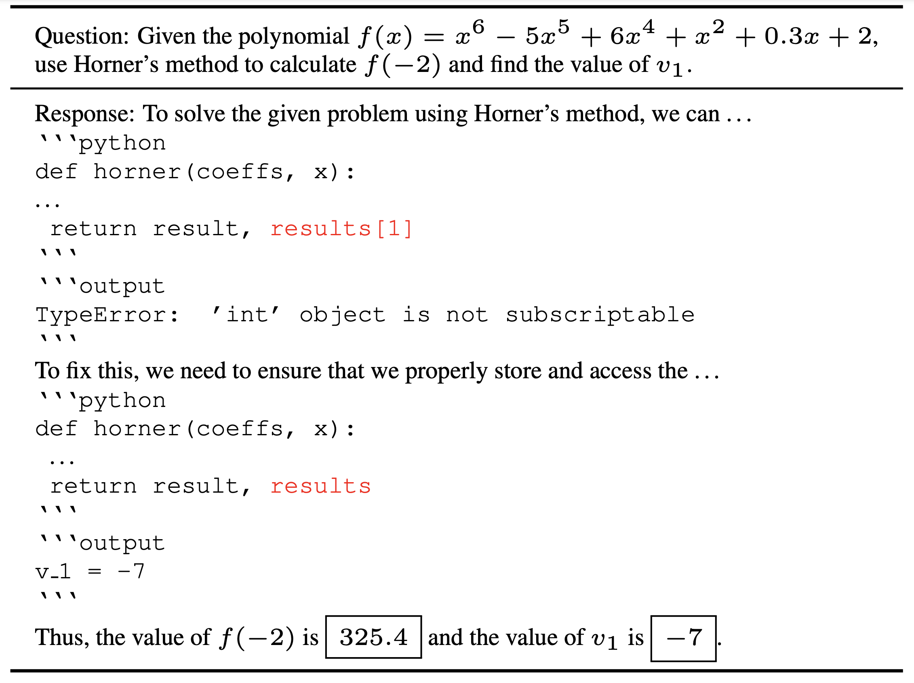
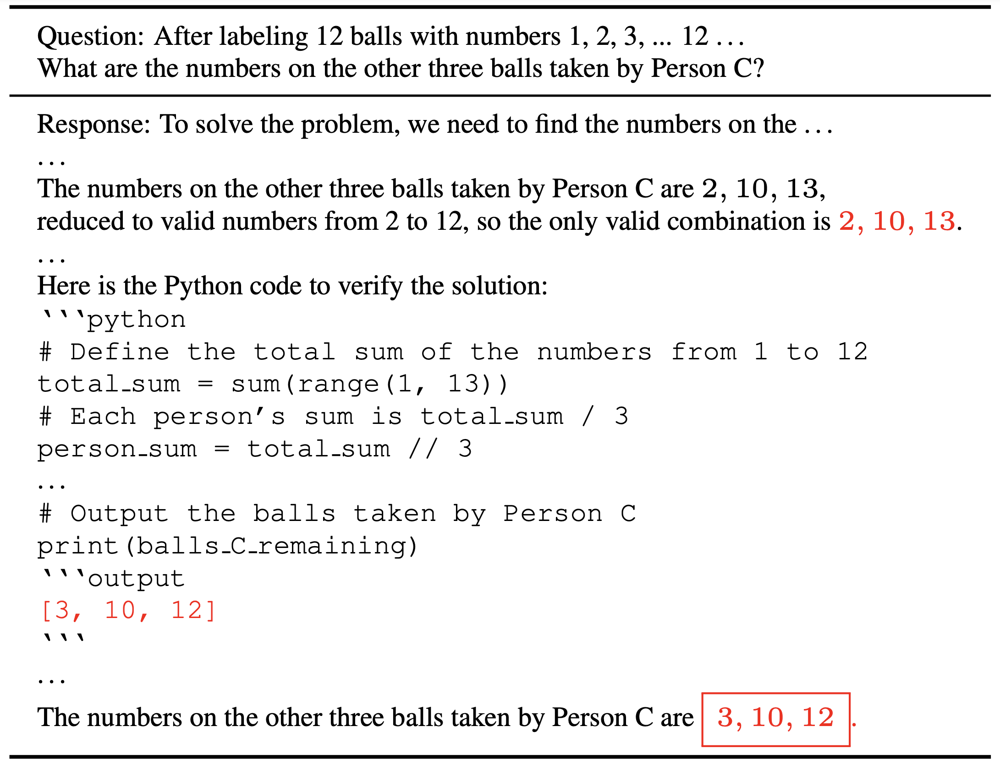

# 
<div align="center">

# ToRL: Scaling Tool-Integrated RL

</div>

<p align="center">
  📄 <a href="https://huggingface.co/datasets/GAIR/ToRL/torl.pdf" target="_blank">Paper</a> &nbsp; | &nbsp;
  🌐 <a href="https://huggingface.co/datasets/GAIR/ToRL" target="_blank">Dataset</a> &nbsp; | &nbsp;
  📘 <a href="https://huggingface.co/GAIR/ToRL" target="_blank">Model</a>
</p>


<div align="center">

</div>

> Performance comparison of ToRL versus baseline models(16-step moving). Both plots show AIME24 Accuracy (%) against training steps across 1.5B and 7B models. In both cases, **ToRL(Ours)** significantly outperforms the baseline without tool and Qwen-2.5-Math-Instruct-TIR, achieving up to **12\%(1.5B)** and **14\%(7B)** higher.


<div align="center">

</div>

> **Emergent cognitive behavior** during training. ToRL first cross-validates the tool's output with reasoning results. Upon detecting inconsistencies, it engages in reflection and further verification through tool calls.


## Releases

[2025/03/28] We're releasing the following components:

- 🚀 **Training**: Complete implementation of our training pipeline
- 🔥 **[ToRL Dataset](https://huggingface.co/datasets/GAIR/ToRL)**: Our curated dataset of 28k mathematical questions
- 🤖 **[ToRL Model](https://huggingface.co/GAIR/ToRL)**: Model training with ToRL.

## Overview

This repository presents **ToRL (Tool-Integrated Reinforcement Learning)**, a framework that challenges traditional approaches to tool integration in language models by enabling LLMs to autonomously discover and refine tool usage strategies through reinforcement learning. Unlike prior methods constrained by supervised fine-tuning or predefined tool patterns, ToRL demonstrates that **exploration-driven learning** with computational tools can unlock emergent cognitive behaviors and achieve state-of-the-art performance on complex reasoning tasks. Notably, our approach operates directly from base models without imitation learning, achieving **43.3% accuracy on AIME2024** with a 7B model—matching the performance of larger 32B models trained with RL.  


### Key Findings  
- **Autonomous Tool Integration**: Models learn **when and how** to invoke tools (e.g., code interpreters) through RL-driven exploration, eliminating dependency on human-curated tool usage patterns.  
- **Emergent Cognitive Abilities**:  
  - Self-correction by cross-validating code execution results with reasoning steps  
  - Adaptive strategy selection between tool-based and pure-reasoning approaches  
  - Self-regulation of ineffective tool calls without explicit supervision  

### ToRL Performance
1.5B Model Performance across challenging mathematical benchmarks:

| Model                            | SFT/RL | Tool | AIME24 | AIME25 | MATH500 | Olympiad | AMC23 | Avg   |
|----------------------------------|--------|------|--------|--------|---------|----------|-------|-------|
| Qwen2.5-Math-1.5B-Instruct       | RL     | ❌    | 10.0   | 10.0   | 66.0    | 31.0     | 62.5  | 35.9  |
| Qwen2.5-Math-1.5B-Instruct-TIR   | RL     |  ✅    | 13.3   | 13.3   | 73.8    | 41.3     | 55.0  | 41.3  |
| **ToRL-1.5B(Ours)**              | RL     |  ✅    | **26.7 (+13.3)** | **26.7 (+13.3)** | **77.8 (+3.0)** | **44.0 (+2.7)** | **67.5 (+5.0)** | **48.5 (+7.2)** |


7B Model Performance across challenging mathematical benchmarks:
| Model                            | SFT/RL | Tool | AIME24 | AIME25 | MATH500 | Olympiad | AMC23 | Avg   |
|----------------------------------|--------|------|--------|--------|---------|----------|-------|-------|
| Qwen2.5-Math-7B-Instruct         | RL     | ❌    | 10.0   | 16.7   | 74.8    | 32.4     | 65.0  | 39.8  |
| Qwen2.5-Math-7B-Instruct-TIR     | RL     |  ✅    | 26.7   | 16.7   | 78.8    | 45.0     | 70.0  | 47.4  |
| SimpleRL-Zero                     | RL     | ❌    | 33.3   | 6.7    | 77.2    | 37.6     | 62.5  | 43.5  |
| rStar-Math-7B                    | SFT    | ❌    | 26.7   | -      | 78.4    | 47.1     | 47.5  | -     |
| Eurus-2-7B-PRIME                  | RL     | ❌    | 26.7   | 13.3   | 79.2    | 42.1     | 57.4  | 43.1  |
| **ToRL-7B(Ours)**                 | RL     |  ✅    | **43.3 (+10.0)** | **30.0 (+13.3)** | **82.2 (+3.0)** | **49.9 (+2.8)** | **75.0 (+5.0)** | **62.1 (+14.7)** |

### Cognitive Behavior via RL Scaling

In the left figure, the code initially generate by the model encountered an execution error, then it is corrected by model and is successfully executed.

In the right figure, the model first derives an incorrect result based on natural language reasoning, then discovers the error during code verification and makes corrections

<div style="display: flex; justify-content: center; gap: 20px;">
    
    
</div>


## Quick Start

### Preparing the Sandbox Environment  
According to the instructions provided in [https://github.com/bytedance/SandboxFusion](https://github.com/bytedance/SandboxFusion), install SandboxFusion and launch it.  

```
# The following command can be used to install the sandbox environment 
# to avoid dependency conflicts.  
# The sandbox environment must be named "sandbox-runtime".  
conda create -n sandbox-runtime python==3.11  
pip install -r runtime/python/requirement.txt  

pip install poetry  
poetry install  
mkdir -p docs/build  
make run-online  
```  

Replace the `sandbox_url` on line `109` of `verl/workers/rollout/vllm_rollout/vllm_rollout_spmd.py` with the your sandbox.  

### Environment setup
```
pip install -r requirements.txt
pip install wandb jsonlines math-verify hydra-core==1.4.0.dev1 sortedcontainers qwen-agent[code_interpreter] qwen-agent[python_executor]
```

### Training

Execute `bash scripts/torl_1.5b` to run ToRL.


## Acknowledgements

Our work builds upon the insightful technical reports from [DeepSeek R1](https://github.com/deepseek-ai/DeepSeek-R1) and [Kimi-k1.5](https://github.com/MoonshotAI/Kimi-k1.5) teams. We extend our appreciation to the [Qwen-Math](https://github.com/QwenLM/Qwen2.5-Math) team for their open-source model, to the creators of [VeRL](https://github.com/volcengine/verl) and [vLLM](https://github.com/vllm-project/vllm) for providing the essential reinforcement learning framework and inference infrastructure, respectively, that enabled this research. and to the [Qwen-Agent](https://github.com/QwenLM/Qwen-Agent) and [Sandbox Fusion](https://github.com/bytedance/SandboxFusion) team, which provided the necessary tools for our research.

## Citation

If you find this work useful, please cite our paper:

```bibtex
@misc{li2025torl,
      title={ToRL: Scaling Tool Integrated RL}, 
      author={Xuefeng Li and Haoyang Zou and Pengfei Liu},
      year={2025},
}
```